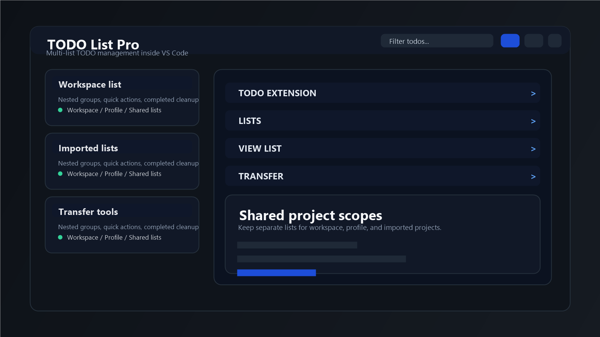
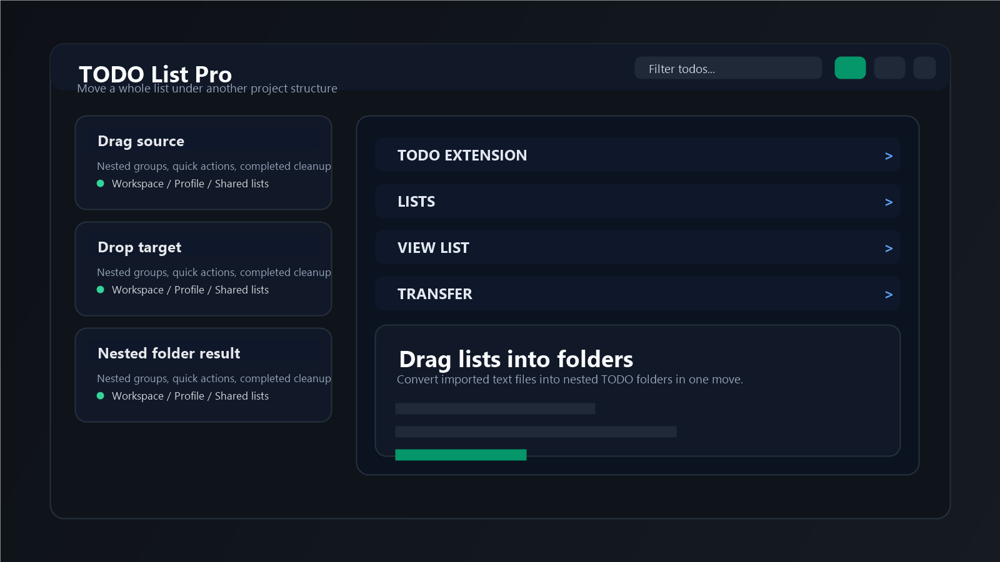
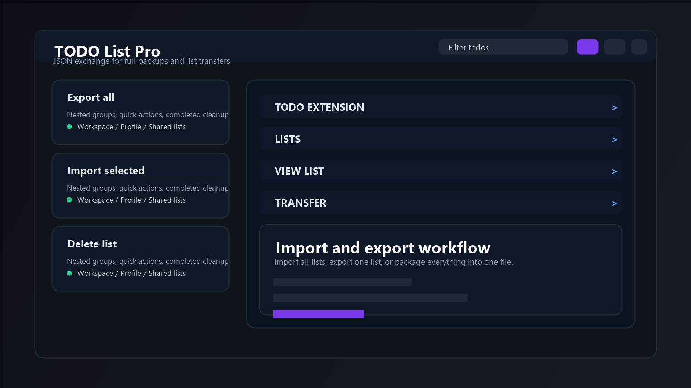

# TODO List Pro

A focused TODO sidebar for VS Code that stays inside the editor instead of sending project notes into a separate app.

TODO List Pro is built for people who need:
- nested groups and subgroups
- separate TODOs per workspace
- shared lists for the same project across multiple workspaces
- profile-wide personal TODOs
- fast import/export for moving notes in and out
- cleanup of completed items after 24 hours

## Why this extension

Most TODO extensions are either too simple or too file-driven. This one is designed as a small project organizer inside the VS Code sidebar:
- keep project tasks in `Workspace`
- keep personal cross-project tasks in `Profile`
- create extra named lists for imported material or shared project scopes
- drag whole lists into another list's folder structure

## Highlights

- Nested groups with hover actions
- Checkbox-style TODO completion
- Filter input always visible at the top
- `Workspace`, `Profile`, and shared project lists
- `LISTS`, `VIEW LIST`, and `TRANSFER` blocks in a VS Code-like accordion layout
- Import/export JSON format for backup and migration
- Clear folder and clear list actions
- Automatic removal of completed items after one day

## Preview







## Main workflows

### 1. Keep TODOs per project

Use the `Workspace` section for tasks that belong only to the currently opened project.

### 2. Keep personal TODOs across machines

Use the `Profile` section for global tasks. When VS Code Settings Sync is enabled, these TODOs can travel with your profile.

### 3. Link multiple workspaces to one shared project list

If the same project lives in multiple workspaces, create a shared workspace project and link both workspaces to that same list.

### 4. Import existing notes

Import one JSON file and turn external text-based TODO collections into structured lists inside the extension.

## Import / export format

The extension uses one JSON format for both export and import:

```json
{
  "version": 1,
  "exportedAt": "2026-03-19T12:00:00.000Z",
  "entries": [
    {
      "targetId": "scope:sample-project",
      "label": "Sample Project",
      "store": {
        "groups": [],
        "hideCompleted": false,
        "expandGroups": true,
        "sectionCollapsed": false,
        "collapsedGroupIds": []
      }
    }
  ]
}
```

## Run in development

1. `npm install`
2. `npm run compile`
3. Press `F5` in VS Code
4. Open the `TODO` activity bar icon in the Extension Development Host

## Packaging and publishing

### Package locally

```bash
vsce package
```

This creates a `.vsix` file you can install manually in VS Code.

### Publish to the VS Code Marketplace

1. Create an Azure DevOps Personal Access Token with Marketplace `Manage` scope.
2. Create a publisher in Visual Studio Marketplace.
3. Change `publisher` in `package.json` from `local` to your real publisher ID.
4. Login:

```bash
vsce login <publisher-id>
```

5. Publish:

```bash
vsce publish
```

## Important note about Marketplace screenshots

VS Code Marketplace requires README images to resolve to `https` URLs. Because this project is not yet connected to a public Git repository, the screenshot files in `media/store/` are ready locally but still need a public HTTPS location for Marketplace rendering.

Typical options:
- push the repo to public GitHub and add `repository` to `package.json`
- or publish with `vsce --baseImagesUrl <https-url> --baseContentUrl <https-url>`

